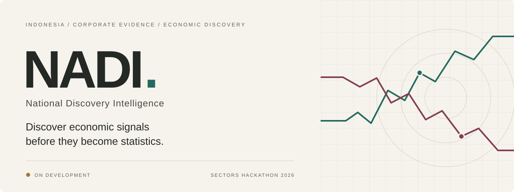
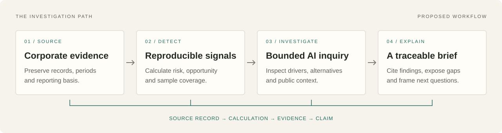

  

  An evidence-first workspace for discovering economic risks and opportunities 
  among Indonesian listed companies.

  <a href="#why-nadi">Why NADI</a> ·
  <a href="#the-analyst-experience">The experience</a> ·
  <a href="#evidence-is-the-product">Evidence</a> ·
  <a href="#delivery-roadmap">Roadmap</a> ·
  <a href="#contributing">Contributing</a>

> [!IMPORTANT]
> **ON DEVELOPMENT** — NADI is at the specification and repository-structure stage. The experience below describes the planned MVP. A runnable application, live integration, and evaluated results are not yet available.

## Why NADI

### The economy has a pulse. Learn to read it.

One company reports weaker margins. Another takes on more debt. Elsewhere, cash generation improves across several businesses. Each disclosure tells a company story. Read together, comparable records may reveal a pattern worth investigating.

**NADI asks: which industries deserve attention, and what observable evidence supports that attention?**

NADI stands for **National Discovery Intelligence**. In Indonesian, *nadi* means pulse. The project brings that idea to economic discovery: observe changes across listed companies, test how widely those changes are shared, and prepare a brief that an analyst can inspect and challenge.

Designed for policy analysts and economic researchers, the planned system combines reproducible signal calculations with an AI investigator that examines evidence and alternative explanations.

## Watch for pressure. Look for possibility.

Economic discovery needs both directions.

| | Risk discovery | Opportunity discovery |
| :--- | :--- | :--- |
| **Observe** | Falling revenue, weaker margins, rising debt relative to assets. | Growing revenue, stronger margins, falling debt relative to assets. |
| **Examine** | Is pressure shared across comparable companies? | Is improvement broad or concentrated in a few companies? |
| **Challenge** | Which companies remain resilient? | Which companies contradict the positive pattern? |
| **Deliver** | Evidence of pressure and questions for further investigation. | Evidence of strengthening fundamentals and questions for further investigation. |

Both directions lead to the same outcome: **a traceable account of what changed, how widespread it is, and what remains uncertain.** A cohort can also show mixed signals or insufficient comparable data.

## The analyst experience

  

### 01 · Find the signal

Open a sector radar ranked by risk or opportunity. See the reporting period, eligible company count, sample coverage, and data age alongside each result. Missing information remains visible.

### 02 · Open the evidence

Inspect the companies and four core measures behind a signal: revenue growth, operating margin change, operating cash-flow margin change, and debt-to-assets change. Follow a calculation to its original values and source record.

### 03 · Investigate the pattern

Ask the AI investigator to examine drivers, seek counterevidence, and compare a reviewed public indicator where definitions and periods permit. The workspace shows actual tool events and their results.

### 04 · Take away a brief

Export a cited Markdown brief with observations, interpretations, hypotheses, evidence gaps, and follow-up questions. The brief retains the dataset, method version, reporting period, and data mode used to produce it.

<strong>Inside a planned investigation brief</strong>

 

**Analyst question:** “Is financial pressure shared across the monitored companies in this industry?”

| Part of the brief | What it should establish |
| :--- | :--- |
| Scope | Which listed companies and reporting periods were examined. |
| Finding | Which reproducible indicators triggered the signal. |
| Breadth | How many eligible companies share the pattern, with exclusions visible. |
| Supporting evidence | The observations and calculations behind each material claim. |
| Counterevidence | Companies or measures that challenge the interpretation. |
| Public context | A compatible comparison, or an explicit explanation of why comparison is unavailable. |
| Next questions | What additional evidence would help evaluate the interpretation. |

This is an illustrative brief structure. It does not report a live sector finding.

## Evidence is the product

An explanation becomes useful when a reader can check it. NADI's planned evidence trail connects each material claim to a calculation or observation, then to an immutable source snapshot.

- **Reproducible calculations.** Versioned code determines scores, coverage, and labels. The LLM investigates and explains those outputs.
- **Visible uncertainty.** Unknown values remain unknown. Excluded companies, reporting limitations, and contradictory evidence stay in view.
- **Stable references.** Investigations use a pinned dataset and signal run so a later refresh does not change the evidence under an existing brief.
- **Explicit data modes.** `live`, `snapshot`, and `synthetic` remain distinct in storage, screens, and exports. Synthetic examples are always labeled.
- **Bounded AI.** The investigator uses validated evidence tools under call, token, and time limits. Claims and numerical facts are checked before publication in a brief.

The method begins as an **experimental heuristic**. Its scores describe observed corporate patterns; they do not express a calibrated probability of crisis. Listed-company coverage does not establish national representativeness, and correlation does not establish a cause.

The tagline expresses a research ambition. Demonstrating a lead over public statistics requires historical evaluation using the dates information actually became available.

## A focused first release

The MVP targets one complete journey: **radar → signal → evidence → investigation → Markdown brief**.

The initial scope is a small set of non-financial company cohorts, up to eight quarters where available, and one curated official public indicator with a reviewed mapping. Actual provider taxonomy and comparable data coverage will determine which cohorts qualify.

### Data foundation

Sectors Financial API v2 is the intended first source for Indonesian listed-company data. Account access, field semantics, reporting basis, historical coverage, and credit limits still require live validation.

Public indicators are complementary context. Each comparison must make its definition, geography, reporting period, and publication date visible; “not comparable” is a valid outcome.

### Engineering direction

| Layer | Proposed default |
| :--- | :--- |
| Interface and API | TypeScript, Next.js, React |
| Persistence | PostgreSQL with immutable source and dataset references |
| Background execution | A separate Node worker backed by database jobs |
| Signal engine | Pure domain logic with decimal arithmetic and versioned rules |
| Investigation | One bounded orchestrator and a provider-neutral LLM adapter |
| Delivery | One repository, one database, web and worker processes |

These are architecture defaults. Dependency versions, model provider, hosting, and software license have not been finalized.

Real-time economic surveillance, nationwide crisis forecasting, trading advice, autonomous policy execution, and causal policy simulation are outside the MVP.

## Delivery roadmap

Implementation proceeds through demonstrable delivery gates. All application gates remain pending.

| Gate | Deliverable | Completion evidence |
| :--- | :--- | :--- |
| **0 · Feasibility** | Verify provider access and select a comparable cohort. | Actual field mapping, reporting basis, coverage, and budget. |
| **1 · Data foundation** | Persist ingestion, source snapshots, datasets, and recoverable jobs. | A reproducible dataset with visible rejected rows. |
| **2 · Discovery** | Compute deterministic signals and build the radar. | Reconstructable scores and passing boundary checks. |
| **3 · Evidence** | Expose source lineage and a curated public comparison. | Traceable inputs and explicit comparability. |
| **4 · Investigation** | Add bounded AI, counterevidence, and claim validation. | A real model-backed brief with validated citations. |
| **5 · Hardening** | Complete export, access controls, recovery, and accessibility. | Verified end-to-end behavior in the declared runtime. |
| **6 · Demonstration** | Prepare a reproducible demo and handoff. | Clearly labeled data, measured results, and documented limitations. |

### Working with this repository

The repository currently contains the product README, visual assets, and initial codebase directories. Installation and startup instructions will be added when executable scripts exist and have been verified.

Synthetic development can proceed while live access is unresolved. A synthetic demonstration will remain distinct from completion of the live MVP.

## Contributing

See [CONTRIBUTING.md](CONTRIBUTING.md) for the review workflow.

Contributions can help establish data coverage, review the economic methodology, implement reliable connectors, evaluate agent claims, or improve the analyst experience.

Start with a concrete problem, describe the evidence behind it, and define how the improvement can be verified. Use clearly fictional synthetic fixtures for public examples, and keep credentials and restricted provider data out of commits.

**License:** a software license has not yet been selected. NADI is being built toward an open-source future; reuse permissions will be defined when a license is added. Third-party data remains subject to its own terms.

---

  <strong>Discover the signal. Follow the evidence. Understand the shift.</strong> 
  NADI · Conceived for Sectors Hackathon 2026 · Indonesia-first

  Independent project. No government affiliation, adoption, or endorsement is implied.

